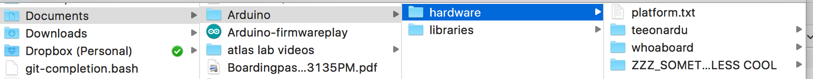
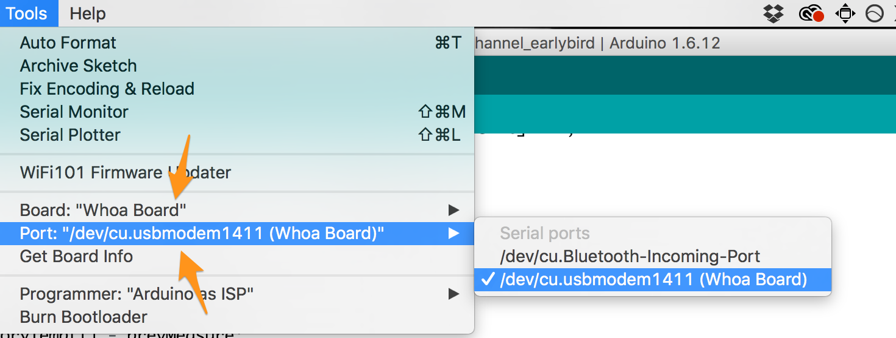
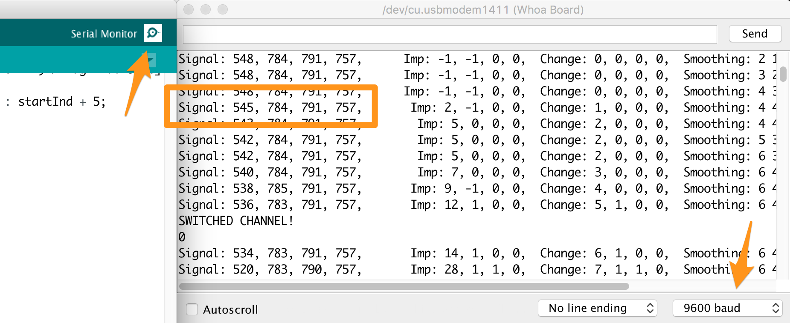
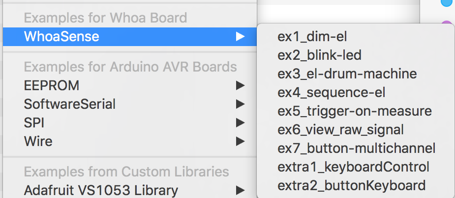
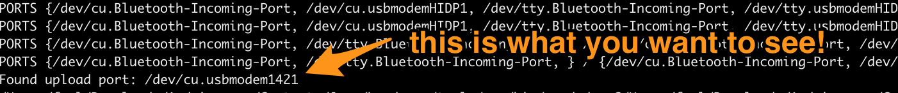
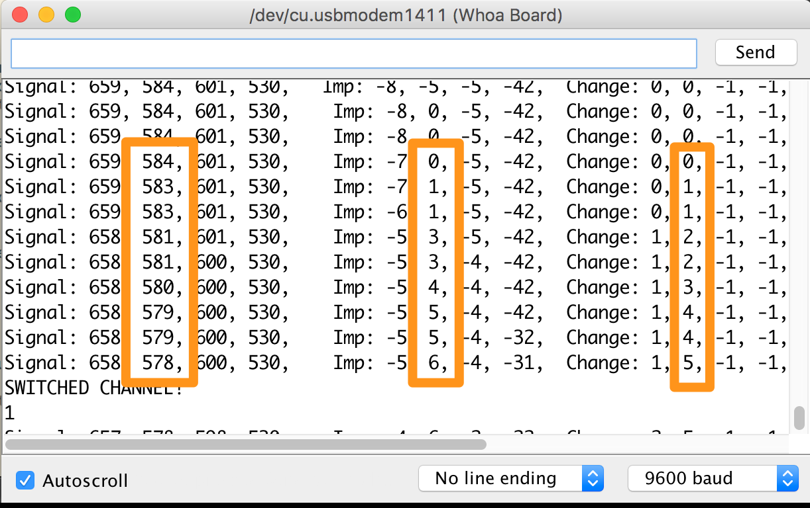

# Hello Hello!

Super glad you could make it!  This here is a guide for getting started with the Whoa Board.  

Before we get started, two things.  

1. If you make something, please share (consider this [forum](https://www.hackster.io/foolish-products/products/whoa-board), but really we're just excited to see what everyone makes and want to make it easy for ideas and insights to flow!).

2. Please fill out this [survey](https://goo.gl/forms/owCjG2DdysAJHh7x2), we'd really appreciate it, and we'll bug you about it if less than half of the early birds respond.

_**Contents**_

* [Quick Start!](#quick-start-)
* [Feature Overview](#feature-overview)
* [Experiments and New Applications](#experiments-and-new-applications)
* [A Major Weirdness](#a-major-weirdness)
* [A More Minor Quirk](#a-more-minor-quirk)
* [Under The Hood](#under-the-hood)
* [License](#license)

Quick Start! 
============

Here lies a brief outline of how to get started! 

Install the [Arduino IDE](https://www.arduino.cc/en/Main/Software) (version 1.6 or higher).

Download this "repo" by clicking the big green button above, like so:

Unzip it.  If you are on windows, open the "windows" folder, and install "whoaboard_driver.exe".

Next, copy the other folders we supply to your arduino sketchbook (which should in "My Documents/Arduino" on windows, and "Documents/Arduino" on Mac/Linux).

If you already have a "hardware" folder in your arduino sketchbook, copy our folders (called whoaboard, teeonardu) into that folder.  These contain the library needed to make the whoa board work and some configuration files.  

This should be it.  

To see if this worked, open the arduino IDE.  Open File -> Examples and make sure that there is an entry for Whoa Board.  

These examples should help you get started by providing a tour of some of the features specific to this board.

Next, plug your board (with a wire connected) into your computer.  You should be able to select it in the tools menu (it might take a few minutes to show up the first time you connect it on windows).

Once you have done this, press the serial monitor button at the upper right hand corner of the Arduino IDE. A new window should pop up.  Set the communication rate to 9600 BAUD, and you should start seeing a stream of numbers.  Try touching the wire!  You should see a decrease in "signal" column which corresponds to that channel.  Now try holding the USB cable powering the board, and touch the wire again!  The signal also depends on how much wire is close to your skin.

It's worth noting that the Whoa Board has much in common with Adafruit's [Flora](https://learn.adafruit.com/category/flora), and resources for it should be largely transferable.  

Feature Overview
================

The Whoa Board is an Arduino Compatible prototyping board, and we have included a number of examples (under file>examples in the arduino IDE) to help you get started! 

<a href=https://github.com/foolish-products/whoaboard_getstarted/tree/master/hardware/whoaboard/avr/libraries/WhoaSense/examples>

 Click here to browse on Github!</a>

These examples distill some of the central concepts that we have used in creating prototypes with this board.  

There are a few demos that are notably missing.  A solid MIDI I/O demo, and wireless/BLE demo (built on top of NRF24 radios and this [bluetooth library](https://github.com/Pranavgulati/RF24BLE)).

However, we do include a number of different examples for logging and controlling the sequence and brightness of the EL elements.  Please give us feedback on what you'd like to see/what documentation needs work, and show us your projects [here!](https://www.hackster.io/foolish-products/products/whoa-board).

The most complicated demo is the button-multichannel, and the hope with it is to provide a reference of how something more robust can be built on top of this board.  

NOTE!  If you run into problems loading a program onto the board pressing the reset button after pressing upload in the IDE can sometimes help the computer establish a connection.  It sometimes takes a few tries to successfully flash a board - particularly if it has a program which sends lots of serial data, or otherwise is largely busy.  

Experiments and New Applications
================================

The main point of the above examples is to make you comfortable experimenting with the "signal stream" produced for each channel (welcome to the matrix).

This signal stream is your paint brush for developing interactions. If you want to see if an interaction is possible, the first thing to do is to check if 
the smoothed signal stream reliably changes when performing the interaction. If you can see a pattern, it is probably possible
to find a set of heuristics which make the board react to it. If you don't see any change, there are a number of signal processing knobs to turn which 
might make it show up. Alternatively, changing the EL material you are using can also have a significant effect. In particular, the Whoa Board's sensing is 
less sensitive through thick plastic. Accordingly, EL panels/paint are much more sensitive than EL wires (and are much better suited for proximity based interactions). 

In terms of EL wires, thinner wires produce signal that is easier to work with than thinner ones. We do not recommend working with wires thicker than the 3.2 mm ones we included as samples.

Creating pieces which respond reliably is something of an art, and if you get stuck ask the community (we'll set up a forum soon. Till then, we're happy to support projects directly!).

A Major Weirdness
================= 

The Whoa Board's sensing works much better when you are touching (or are close to) something that shares a ground with the board power supply. 

If you are powering it from a computer that is plugged into the wall, it will probably be much more sensitive than when powered from a small Li-Ion 
battery pack. 

The key to improving sensitivity is to place a connection to ground near your body. Touch the USB power cable, or a ground pin on the board (they are labeled). 
Sew a patch of conductive fabric into your wearable, and connect that to the ground pin of the board. Become one with gaia.

This part also works on proximity, so you don't actually have to have contact with skin in order for the sensitivity to improve. 

This weirdness presents a design problem in the construction of wearables, but one which has been workable in our experience. 

A More Minor Quirk
==================

The Whoa Boards sensing circuit can only work when the wire is turned off. Further, the measurement operation takes time.

The precise amount of time is a parameter which can be tuned (the longer you wait, the stronger your signal). 

For the default program, we set the charging time to be 1700 microseconds. With this charging time, the entire measurement operation 
on all four channels takes ~3 milliseconds.

Note that the human eye begins to see flickering at ~60Hz (or ~16 milliseconds per cycle). 

This means that in order to avoid unintended flickering on the EL material, all processing must allow for a sensing operation to take place every ~8-12 milliseconds.

Under the Hood
==============

Extracting a signal from this board is a somewhat subtle, multi-staged, process. Here are the steps, in order of utility. 

    1. Application Level Logic 
- This is where one bridges the gap between the smoothed signal and a desired interaction. 

For our "button" example, the main heuristic we use is that when the EL element is touched, it consistently decreases over a series of measurements. 

If you are working with a more concrete application, it might be easier to achieve reliable by triggering by comparing the signal value to some experimentally determined threshold.

    2. Signal Smoothing
- The raw signal that is collected from the board can be quite noisy. We extract a smoothed signal from every measurement 
by performing computations on a sliding window of past measurements. 

This smoothing technique is the product of extensive testing, and in our experience strikes a reasonable balance between signal stability and responsiveness for general application. 
However, there are occasions where you might want to process the raw signal in a different way. In the later examples we expose some parameters which can be useful for this sort of tuning.  

    3. Orchestration 
- The sequence of steps that need to be performed to collect a "raw" capacitative measurement.

One experimental feature of this board is the capability to pass an external EL supply through the board, 
and to perform capacitative measurements on that. Using this feature requires making orchestration changes (among other things).
If you are interested in testing this feature, please contact us first (josh [at] foolishproducts.com, include the word "External" in the subject).

    4. Configuration
- Low level hardware setup necessary for successful operation of the Whoa Board.

It is unlikely that you will need to touch anything on this level as you play with this board.

License
=======

The code in this library is released under the Apache license, and the hardware design of the board is patent pending. 

If you are experimenting, playing, or otherwise exploring, we're very glad to have you, and hope that you'll document/share your discoveries (one final shout out to this [forum](https://www.hackster.io/foolish-products/products/whoa-board) ).

If you land on the path of commercialization (or otherwise start needing to independently control lots of EL channels), please reach out regarding volume ordering/hardware licensing (josh [at] foolishproducts.com, include the word "commercial" in the subject).

